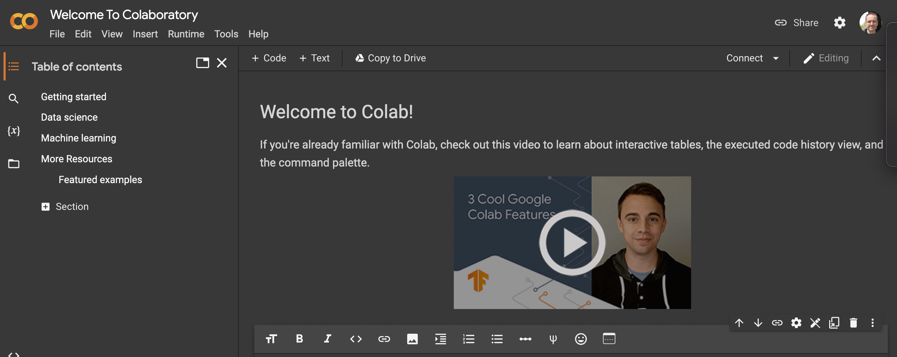

```{r setup, include=FALSE}
knitr::opts_chunk$set(echo = TRUE)
library(png)
library(grid)
```


## Introduction

The guide below details how to install tensorflow and keras on your own computer, using either the Python or R interface. The installation can be tricky as tensorflow is under active development and different versions may not always work well with other libraries. These instructions were found to work in *most* cases. 

## Google colab

If you are planning on using the Python version, an alternative is to use the version available through Google's Colaboratory or colab. This is a free service for anyone with a google account, where you can run Python code in an interactive environment. Colab uses notebooks, similar to the Jupyter notebooks we have used elsewhere in this class. 

### Getting started with colab

The only pre-requirement for using colab is a Google account. Fortunately, the University provides an account to all students through the google cloud services. Go to [this link][gcloudID] to login into your account. Once you have successfully logged in, go to the [colab website][colabID]. If everything has worked, you should see this welcome screen:



To get started, just go to File > New notebook to open a new instance and notebook. 

### Accessing data on colab

If you are using the colab services then you will also need to access files. Google provide about 77Gb of disk space with the basic colab account, and you can upgrade to a Pro account if you need more space. There are three main ways to upload your data to your colab instance:

1. From Github

If you have data in a Github repository, click on the file in your repository, then click on `View Raw`. Store the URL as a string in your colab notebook, them use Pandas `read_csv` function to read in the data. 

```
import pandas as pd
url = 'link_from_github'

df = pd.read_csv(url)
```

2. From a local drive

If you add the following code to a colab notebook cell and run it, it will create an upload widget (a [Choose files] button) will appear under the cell. Click this, then select the file or files you want to upload. 

```
from google.colab import files
uploaded = files.upload()
```

The files will be stored in a Python list called `uploaded`. You can then extract any of these using the name of the file:

```
import io
df = pd.read_csv(io.BytesIO(uploaded['myfile.csv']))
```

3. From a Google drive

You can also link your Google drive to your colab instance (note you will need to do this each time your start working in your notebook). Start by creating a folder in your Google drive (e.g. `data`), and add a csv file there. Next go to colab, and enter the following code to link your Google drive:

```
from google.colab import drive
drive.mount('/content/drive')
```

The path to your `data` folder is now `/content/drive/MyDrive/data`, and you can now use Pandas to read the data

```
import pandas as pd
df = pd.read_csv('/content/drive/MyDrive/data/myfile.csv')
```

Note that while this works well for smaller files, the transfer time between Drive and colab can be quite long, which can make working with large file collections quite slow. 

## Installing a local version of tensorflow

### Python version

#### Mac OSX

1.	Create a folder (e.g. `tf_test`) on the desktop
2.	Open a terminal and go to this folder (`cd ~/Desktop/tf_test`)
3.	Create a virtual environment (`virtualenv .venv`) You may need to install this with `pip install virtualenv`
4.	Activate it (`source .venv/bin/activate`)
5.	Check python version (`which python`) (should be < 3.9)
6.	Install numpy, pandas, matplotlib, tensorflow and keras packages with pip (e.g. `pip install numpy`) 
7.	install jupyter notebook: `pip install notebook`, and then launch the server with `jupyter notebook`
8.	In the notebook, import tensorflow with `import tensorflow as tf`
9.	Now build a simple model

```
from tensorflow.keras import models
from tensorflow.keras import layers
model = models.Sequential(layers.Dense(units = 16, activation = ‘relu’, input_shape = (20,)))
print(model.summary())
```

10.	When you are done, you can deactivate the virtual environment by typing `deactivate` in the terminal window

#### Windows

1.	Create a folder (e.g. `tf_test`) on the desktop
2.	Open a terminal (e.g the Anaconda prompt window) and go to this folder (`cd Desktop/tf_test`)
3.	Create a virtual environment (`virtualenv .venv`). You may need to install this with `pip install virtualenv`
4.	Activate it (`.\.venv\Scripts\activate`)
5.	Check python version (`which python`) (should be < 3.9)
6.	Install numpy, pandas, matplotlib, tensorflow and keras packages with pip (e.g. `pip install numpy`) 
7.	install jupyter notebook: `pip install notebook`, and then launch the server with `jupyter notebook`
8.	In the notebook, import tensorflow with `import tensorflow as tf`
9.	Now build a simple model

```
from tensorflow.keras import models
from tensorflow.keras import layers
model = models.Sequential(layers.Dense(units = 16, activation = ‘relu’, input_shape = (20,)))
print(model.summary())
```

10.	When you are done, you can deactivate the virtual environment by typing `deactivate` in the terminal window

### R version

#### Mac OSX

1.	Create a folder (e.g. `tf_test`) on the desktop
2.	Open a terminal and go to this folder (`cd ~/Desktop/tf_test`)
3.	Create a virtual environment (`virtualenv .venv`) You may need to install this with `pip install virtualenv`
4.	Activate it (`source .venv/bin/activate`)
5.	Check python version (`which python`) (should be < 3.9)
6.	Install numpy, pandas, matplotlib, tensorflow and keras packages with pip (e.g. `pip install numpy`) 
7.	Open RStudio
8.	Run this command in RStudio: `Sys.setenv(RETICULATE_PYTHON = "/Users/username/Desktop/tf_test/.venv/bin/python")`
9.	Load tensorflow libraries: `library(tensorflow)`
10.	Check tensorflow version: `tf_config()`
11.	Load keras: `library(keras)`
12.	Build a simple model: `model <- keras_model_sequential() %>% layer_dense(units = 16, activation = “relu”, input_shape = c(20))`
13.	When you are done, you can deactivate the virtual environment by typing `deactivate` in the terminal window

#### Windows

1.	Create a folder (e.g. `tf_test`) on the desktop
2.	Open a terminal (e.g the Anaconda prompt window) and go to this folder (`cd Desktop/tf_test`)
3.	Create a virtual environment (`virtualenv .venv`). You may need to install this with `pip install virtualenv`
4.	Activate it (`.\.venv\Scripts\activate`)
5.	Check python version (`which python`) (should be < 3.9)
6.	Install numpy, pandas, matplotlib, tensorflow and keras packages with pip (e.g. `pip install numpy`) 
7.	Open RStudio
8.	Run this command in RStudio: `Sys.setenv(RETICULATE_PYTHON = "C:/Users/username/Desktop/tf_test/.venv/Scripts/python.exe")`
9.	Load tensorflow libraries: `library(tensorflow)`
10.	Check tensorflow version: `tf_config()`
11.	Load keras: `library(keras)`
12.	Build a simple model: `model <- keras_model_sequential() %>% layer_dense(units = 16, activation = “relu”, input_shape = c(20))`
13.	When you are done, you can deactivate the virtual environment by typing `deactivate` in the terminal window

Note that this also works if you having trouble installing tensorflow with your existing python version. Follow everything to step 6, then install jupyter notebook: `pip install notebook`, and then launch the server with `jupyter notebook`

[gcloudID]: https://gcloud.utah.edu
[colabID]: https://colab.research.google.com