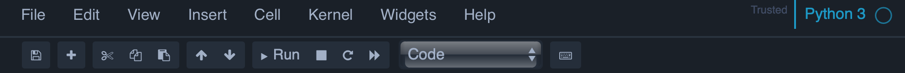

In this lab, we will introduce the basic functionality of Python, together with some simple plotting functions. We will be using the following files for these examples:

- A dataset of morphological measurements of three species of penguin *penguins.csv*
- A jupyter notebook showing some basic Python commands for working with data files: *geog_5160_6160_lab01.ipynb*

More information about the dataset can be found here: [https://allisonhorst.github.io/palmerpenguins/index.html](https://allisonhorst.github.io/palmerpenguins/index.html)


# Introduction to Python

Python is a high level programming language, designed for handling data (rather than software development). It is an interpreted language, which allows you to write relatively straightforward code that is then compiled in order to be run. This means that the code you write can be easily transferred between computers and operating systems, and you can just let the Python interpreter on the computer do all the work for you. In contrast to other programming languages it is dynamically typed, so you don't need to track and declare all your variables, which generally means that it is easier to set up and run Python code than most low-level languages (e.g. c++), but with a higher risk of encountering problems with the variables you use (although these are pretty rare). 

Python also has a large number of add-on [packages][packID] that extend the basic function, and we'll be using several of these for machine learning. Today, we'll just use a couple of these for data manipulation and plotting. 

## Getting started

For this class, the labs will assume that you have your files organized according to the following structure:

```
+-- geog5160
|   +-- datafiles
|   +-- lab01
|   +-- lab02
|   +-- lab03
...
|   +-- lab11
```

To do this, go to your `Documents` folder, and create a new folder called `geog6000`. In this now create two new folders, one called `datafiles` (where we will store all the data used across all labs and one called `lab01`, which we will use for today's lab. 

Now download the *penguins.csv* file from Canvas and move this to the `datafiles` subfolder. Download the notebook and move this to your `lab01` folder. 

# Installing Python

There are two commonly used versions of Python: 2.7 and 3. Version 3 was released in 2008 and there has been a gradual transition to only using 3 (support for 2.x was stopped in 2020). In this class, we will only use Python 3. There are several [packaged distributions][distID] of Python that come with additional utilities. I would recommend using miniconda (these labs were written using this). Instructions for installing miniconda can be found [here][mcID]. Make sure you install version 3.8 (or higher) and that you are installing the 64bit version. 

# Using conda

## Starting Python

### Windows

In windows, you can run the conda version of Python by going to the [Start Menu] > [Anaconda (64-bit)] > [Anaconda prompt]. This will launch a new terminal window, and if conda has been correctly installed you should see the following prompt: 

```
(base) C:\Users\username>
```

### Mac OSX

Open any terminal. If conda has been correctly installed, you should see the following prompt

```
(base) username:
```

### Linux

Open any terminal. If conda has been correctly installed, you should see the following prompt

```
(base) username:
```

## Changing directories

In order to access the files, you'll need to change directory in your terminal to the `lab01` folder you made earlier using the `cd` command. If you know the full path to the folder, then simply enter:

```
cd /full/path/to/folder
```

Once you've successfully changed directories, check that the notebook file is in your folder you have changed to by type `ls` to list the files. 

### Windows

Finding this path can be challenging on Windows, but the easiest was is to find the folder in Windows Explorer, right click on it and go to 'Properties'. If you've created this in your Documents folder, the path will be something like `C:/Users/username/Documents/geog5160/lab01`. 

### Max OSX

On a Mac, you can find the path to a folder in the Finder window, by clicking on [View] > [Show Path Bar]. If you've created this in your Documents folder, the path will be something like `/Users/username/Documents/geog5160/lab01`. 

### Linux

On a Linux system, the folder will be somewhere in your home directory. If you've created this in your Documents folder, the path will be something like `/home/username/Documents/geog5160/lab01`. 

## conda environments

One of the key features of conda is the use of environments. Each environment represents an isolated Python session, and so can be set up differently. This can help to avoid conflicts between add-on packages; you can create an environment for a particular type of analysis or data processing and only install the packages that you actually need. If conflicts arise, it is then easy to delete the environment and try to set it up again, all without impacting the base install of Python. The default environment is `base` (hence the `(base)` shown before the prompt). In general, you should only install packages here if you are likely to use them a lot. Packages that are specific to a given project should only be installed in that environment. 

To create a new environment, simply type

```
conda create -n new-env
```

Python may ask you about the installation location for this environment, just accept the default. The environment will be set up then made available for use. Note that this only creates the environment, but you are still in the `base` environment. To change to `new-env`, type

```
conda activate new-env
```

Any you should see the prompt change from `(base)` to `(new-env)`. If you want to see a list of all the available environments (the current one will be listed with a `*`):

```
conda env list
```

You can stop your current environment return to the `base` environment:

```
conda deactivate
```

And environments can be deleted as follows:

```
conda env remove -n new-env
```

Now create an environment for class work (called `geog5160`)

```
conda create -n geog5160
conda activate geog5160
```

### Installing packages

The `conda` command can also be used to install packages. To demonstrate this, we'll start by installing the Jupyter Noteback package. This provides an interactive framework for testing and running Python code through your browser. Go to your terminal and enter the following code:

```
conda install -c conda-forge notebook
```

And press [y] to install all the supplementary packages. This will install `notebook` from the `conda-forge` repository or channel. There are several channels that host these packages, and `conda` uses anaconda.com by default. If your package is hosted elsewhere you need to specify this with the `-c` argument. The best way to find out where a particular package is held is by googling `conda install packagename` and following the links. Once you run this command, conda will check your local environment against the remote one, and download the necessary files to install the notebook (this includes any dependencies). Once you see the following three lines, the installation is complete:

```
  Preparing transaction: done
  Verifying transaction: done
  Executing transaction: done
```

Now we'll install the `pandas` package to help with data manipulation and the `matplot` and `seaborn` packages for making simple plots:

```
conda install pandas
conda install matplotlib
conda install seaborn
```

You will likely be prompted to install some supplementary packages; just press [y] to continue and install these. 

### jupyter notebooks

For the labs in the class, the Python code will be provided as jupyter notebooks. These are interactive html pages, that contain code and the output from that code, and are a convenient way to keep your Python work organized and test new ideas. To open one of these, you first need to start the notebook server:

```
jupyter notebook
```

This will launch a new page in your web browser with a list of the files that are available in your current directory. 


Clicking on any of these will then open the notebook on a new browser page. Or you can open a new notebook by clicking on the [New] button in the top right. A notebook consists of a set of *cells*, blocks of code or text. Each cell has a set type: generally either code or markdown. Markdown cells are used for descriptive text, and can be formatted using basic markdown tags. Code cells are where you enter your Python code. Once you have entered your code, you can then click the [Run] button to run it, and any output will appear below the cell:


At the top of the page there are a set of menus and actions buttons. The arrows allow you to move through the available cells, and the [+] button adds a new cell below your current position. The [Cell] menu has a lot of options for changing the cell type and for running different parts of the notebook (e.g. run all the cells above your current position). 



If you've got this far, we'll switch to the jupyter notebook for the remainder of this lab. If you haven't used these notebooks before, it's probably worth spending a little time working with a new one at some point to get used to navigating through them. 

[pydlID]: https://www.Python.org/downloads/
[distID]: https://wiki.Python.org/moin/PythonDistributions
[mcID]: https://docs.conda.io/projects/conda/en/latest/user-guide/install/index.html#
[packID]: https://wiki.Python.org/moin/UsefulModules