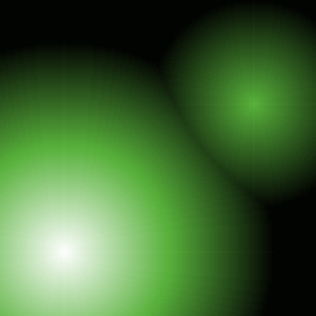
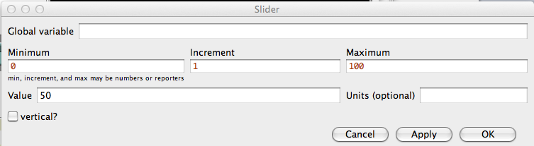
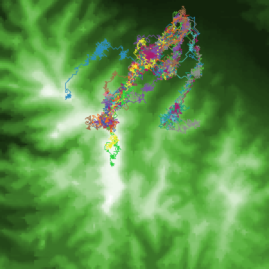

```{r setup, include=FALSE}
knitr::opts_chunk$set(echo = TRUE)
```

##Introduction
In this lab, you will implement the model of butterfly movement introduced in class. This example is taken from the book: “Agent-Based and Individual-Based Modeling” by Railsback and Grimm (2012), and our example follows their steps. 

The basis of the model is that butterflies move uphill to find mates, a process known as "hill-topping". In the model, we expect that this is not deterministic, but stochastic, in other words, at each turn a butterfly has a certain chance of moving uphill, otherwise it will simply move randomly. The goal of this exercise is to explore how the area travelled over by the butterflies changes as we modify this chance of moving uphill. The model therefore gives a good, simple demonstration of how an agent (turtle) interacts with the landscape (patches).

To do this, we will follow the previous lab by first programming the overall structure of the model, then filling in the details. This allows us to get a working flow for the model, rather than getting lost in the details. As we start to add further parts, we will run tests to make sure that the model is developing correctly. 

As a reminder, introduced the basic components of a Netlogo model are turtles, patches and globals. The *turtles* are Netlogo’s term for an agent, here the butterflies; the *patches* are the landscape, which will need an elevation value; *globals* represents the whole system and is used for any external variables. 

## Setting up model structure

From the File menu in Netlogo, create a new Netlogo program, and use File/Save save this as "Butterfly1.nlogo" in an appropriate folder. If you close Netlogo at any point, you can reopen this model, by finding the model file in this folder, and double-clicking on the icon. 

Now we start by entering the state (general) variables. Click on the [Code] tab (this is the [Properties] tab in older versions of Netlogo) and insert the following code:

```
globals [ ]
patches-own [ ]
turtles-own [ ]
```

This defines variables for the entire system (global), the landscape (patches) and the agents (turtles). Click the [Check] button to make sure that the syntax is entered correctly (remember to click this button after every update). 

In the model, the turtles (butterflies) have no variables other than their coordinates (`xcor`, `ycor`) and these are defined by default, so we have no need to enter them here. The patches require a variable to store their elevation, so enter this as state variable for patches:

```
patches-own [ elevation ]
```

Now use the [Settings] menu to change the spatial extent of the model to make an area covering 150x150 pixels. Set the origin to the bottom left corner amd turn off world-wrapping. Remember that you might need to change the patch size to keep the View window visible on your screen. 

Finally, we will add the setup routine into the code. Add the following lines, after the code you have already entered:
	
```
to setup
  ca
  ask patches
  [
  
  ]
  reset-ticks
end
```

As a reminder: Any procedure in Netlogo starts with the keyword `to` and ends with the keyword `end`. The next command `ca` is short for `clear-all` and removes all existing data stored in the model. This is nearly always the first command used in a model. The command `reset-ticks` is nearly always the last command, and sets the model clock back to zero to allow for a new model run. The command `ask patches` will be used to set initial values for each landscape patch – when Netlogo runs this, it will loop through each patch in a random order, then carry out any commands within the brackets. The `ask` command can also be used with turtles, as we will see later. 

### Setting up the model landscape

The initial model landscape will simply consist of two conical hills, with peaks situated at coordinates 30,30 and 120,100. The first hill has an elevation of 100 units and the second 50 units. We assume that elevation decreases by one unit for every unit of horizontal distance away from the peaks. We can calculate the elevation for each patch on the first and second hill and the final elevation will be the greatest of these (to allow for overlap between the two hills). 

Enter the following code between to the `ask patches` command in the `setup` procedure:

```	
ask patches
[
	let elev1 100 – distancexy 30 30
  let elev2 50 – distancexy 120 100

	ifelse elev1 > elev2
    [ set elevation elev1 ]
	  [ set elevation elev2 ]

	set pcolor scale-color green elevation 0 100
]
```

Remember that the `ask patches` code will loop through all patches in a random order. In the first lines of the code we estimate the elevation for a patch given its distance from the peak of hill 1 (`elev1`), we then repeat this for hill two (`elev2`). This uses a built-in command `distancexy` to get the distance. To get information about any of the commands, click on the command in the code window and press F1. 

The `ifelse` command compares the two elevations, and then sets the `elevation` variable of the patch to the higher of the two. 

The final line sets the color of the patch according to its elevation. Note that we use `pcolor` to refer to the patch color (`color` refers to the color of a turtle). The `scale-color` simply produces a scale of greens from 0 to 100 and sets `pcolor` (the patch color) according to elevation. Hit the [Check] button to make sure there are no errors.

The final stage is to include a button on the interface tab to run the setup procedure. Remember that you can add this by clicking on the [Button] button on the interface tab and selecting “Button”. Type “setup” in the Commands field, and click “OK”

Now this button has been linked to the setup procedure, you can click on it, and a landscape should be produced with the two hills:



Setting up the landscape can take some time, particularly if the model is set to run at a slow tick speed or if the landscape is very large. A simple fix for this is to add:
"no-display" after clear-all (or "ca") in the setup procedure; then add "display" after the patches are created (or just before "reset-ticks").

### Adding agents to the landscape
Now we need to create some agents (turtles in Netlogo) to represent the butterflies. This uses the command `create-turtles` also abbreviated to `crt`. To create a single turtle, use `crt 1 []`. The brackets allow us to include some code to set various attributes for that turtle. 

Enter the following code in the setup procedure, after the ask patches statement:

```
crt 1 
[
  set size 4
  setxy 85 95
]
```

The additional code here sets the size of the turtle icon, the second sets the coordinates of the turtle’s starting position on the landscape.

Click the check button, and then go back to the interface and click the [setup] button. A turtle/butterfly should now appear on the landscape between the two hills. 

## Controlling model flow

We now add the procedure that will control the flow of the model. This is typically called "go", and we will stick to that here. 

Following the end of the setup procedure, add the following code:

```
to go
	ask turtles [ move ]
	tick
	if ticks >= 1000 [ stop ]
end
```

The code between `to go` and `end` will be repeated for each iteration of the model. In this case, we use the `ask` function to loop through all the turtles (just one for the moment), and then use the commands within the brackets to change and update the turtle behavior. Once all turtles have been updated, we include the command `tick` which advances time by one step (or tick) and a final line that stops the model flow if the number of ticks is greater than or equal to 1000. This prevents the model for running eternally. 

In the previous step, we have included a command `move` which will dictate how the turtles move. This is not a built-in function, so we need to define it ourselves. Use the following code to add a skeleton procedure (i.e. with no working code) after the `go` procedure

```
to move

end
```

Click on the Check button, then go to the interface tab, and add a “go” button to link to the go procedure. Follow the same steps used to create the setup button, but this time check the “Forever” box. 

## Modeling agent movement
If everything else works, it is now time to add the part of the model that will control how the butterflies will move across the landscape. This is designed to be a stochastic procedure, wherein a butterfly will have a certain probability of moving to the highest surrounding patch, or will simply move in a random direction. 

Add the following code to the move procedure

```	
to move
	ifelse random-float 1 < q
		[ uphill elevation ]
		[ move-to one-of neighbors ]
end
```

We use the `random-float` command to generate a random number between 0 and 1 (`random-float 1`) and compare this with the set probability `q`. If the random number is less than the probability we move to the neighbor with the highest elevation. This uses the built-in command `uphill`, which moves a turtle to the neighboring patch with the highest value of some variable, here elevation.

If the random number is greater than the probability we move to a neighbor at random. Here we use three built-in functions (Remember to use F1 to see descriptions of any of these functions):

1. `move-to`: this moves a turtle to a new location (a patch, xy coordinates, etc)
2. `one-of`: this selects one object at random from a list
3. `neighbors`: this returns the list of patches that surround the current location of a turtle

The last step is to define `q`, the probability of moving uphill. To do this you need to carry out two steps

1.	Define `q` as a global variable at the start of the code:
```	
globals [ q ]
```
2.	Set the value of q at the end of the setup procedure before `reset-ticks`:
```
set q 0.4
```

Click on the [Check] button, and return to the interface page. Rerun the setup, then click on the [go] button, and you should see your butterfly move to the summit of the hill. You will probably need to slow the speed of the model to see what is going on. Move the slider at the top of the interface toward the left until it reads “slower”, then re-run model (including the setup). You should now see the butterfly moving in a random way, but with a general progression up the hill. 

Congratulation! You have built and run your first agent-based model. We will now extend the model to carry out an experiment

## Extending the model
The first thing we will do is to add a trace to the movement of the butterfly, so that we can see its movement

### Tracing movement
Add the following line between the brackets of the `crt 1` statement:

```
pen-down
```

Check the code and re-run – you should now see a trace representing the path taken by the butterfly

### Calculating movement variation
At present the model simply produces a visual representation of the movement of the butterfly. We will now extend the model to record some aspect of the movement, namely the total number of patches visited by the butterfly. This will require a series of steps

Add a logical variable `used?` to each patch (as a reminder, the "?" tells Netlogo that it is a Boolean variable (true/false)). To do this, change the `patches-own` statement to read

```
patches-own [
		elevation
		used?
]
```

Set the value of this variable to `FALSE` for all patches. Add the following to the `ask patches` statement in the "setup" procedure to set the default value to `FALSE` for all patches:
	
```
set used? FALSE
```

Set the value of this variable to TRUE every time a butterfly moves to a new patch. Add the following to the “move” procedure:

```
set used? TRUE
```

Add a monitor to the interface to display the number of patches visited. Right-click on the interface and select “Monitor” from the list, then place the cursor somewhere to the left of the View window. Click the mouse button and a monitor will appear, together with a dialog box:
 
Add the following code to the “Reporter” box to calculate the number of used patches (i.e. patches with the variable `used?` set to `TRUE`):

```
count patches with [ used? = TRUE ]
```

Re-run the setup and them the model. The box will now display the number of patches used on each run. Try running this several time to get an idea of the variation in the number of patches resulting simply from the stochastic nature of the model

### Adding a slider
Netlogo comes with a set of buttons, sliders and switches to control model behavior. We will now add a slider to allow us to set the value of `q`, the probability of a butterfly moving uphill. Click on the Button button on the interface, and select slider from the drop-down menu. Click on the blank space to the left of the world view window (where the setup and go buttons are), and a new slider will be created. The following dialog window will open, allowing you to set the parameters of this slider:



Set the "Global variable" as `q`. Some default limits are given when the slider is created, but you will need to adjust these so that they are suitable for `q`. Set the limits and increments for the slider as follows:

- Minimum: 0
- Increment: 0.1
- Maximum: 1. 

Set the Value to 0.5. This will be the default starting value. Click [OK] and the slider will be created

Netlogo will now complain that `q` is already defined, as we have previously defined this in the code. Netlogo does not allow for multiple definitions of a variable, and sliders define and initialize the variable they control. Remove the references to `q` from the code: 

- In the definition of global variables at the start of the code. 
- In the setup procedure, where `q` is set to a value
Note that if you remove the slider later, you will need to replace `q` in the code section. 

As before, once you have removed the code, click the [Check] button, then re-run the model to check that everything works. Try using the slider to change values of `q` and re-run. One very useful feature of sliders is that you can use them to change the value of the parameter during the model run. For example, try running the model with a very high value of `q`, then stop, set `q` to a low value and click the [go] button again (you may need to slow the model speed to do this). 

## Calculating corridor width
So far, we have measured the number of patches visited by the butterfly during the model run. The goal of the model is to simulate virtual corridors, and a better measure of this is corridor width. We will estimate this as the number of patches visited divided by the average distance travelled by the butterflies. We will need to calculate the latter parameter. To do this, we will first need to record the initial position of each butterfly, as follows:

1.	Add a variable called `start-patch` to the turtles-own statement
2.	In the `setup` procedure, add the following code in the `crt` statement:

```
set start-patch patch-here
```

Now we create a new procedure that will calculate a) the number of patches visited; b) the average distance travelled by each butterfly; c) the corridor width. Note that this is a reporter procedure (i.e. it will calculate and report back a value), so we use the function `to-report` instead of `to`. Add this code to the end of your model:

```
to-report corridor-width
	let num-patches-used count patches with [used?]
	let avg-dist-moved mean [ distance start-patch ] of turtles
	report num-patches-used / avg-dist-moved
end
```
This code does the following:

1.	Creates a local variable `num-patches-used` containing the number of patches that have been visited (have the variable `used? = TRUE`). Note that this uses the `let` command, rather than the `set` command to create a variable that is only used in this procedure.
2.	Creates a local variable `avg-dist-moved` which calculates, for each turtle the distance between its current position and its start-patch, then takes the mean
3.	Uses the function `report` to calculate and assign a value to the variable `corridor-width` equal to the number of patches divided by mean distance

Finally, add a monitor window to the interface that will show the value reported by the procedure `corridor-width`. See above for notes on how to do this. 

## Assignment
Use a word document to record your answers and screenshots of your output. Assignments, to include both the word document and .nlogo script file, should be submitted to Canvas before class on Monday, February 12. Ensure your assignment has been saved using the following naming convention: Lab03_lastname_script and Lab03_lastname_report. 

1.	Briefly describe the ruleset underlying this model (1)
2.	Increase the number of butterflies in the model from 1 to 20. Once you have done this, check and re-run the model. Provide a screenshot of the output (right-click on the world-view window and select “Copy view”; then paste this into a word document). (1)
3.	The basic landscape is very smooth. Add some random noise to the elevation data to represent local variation in the topography. To do this, change the set elevation code as follows (you will need to do this for elev1 and elev2): 

```
set elevation elev1 + random-float 10
```
	Provide a screenshot of the resulting landscape, and comment briefly on the effect on butterfly movement. [1]
4. Run a series of experiments in which you vary the probability of moving uphill (`q`) from 0 to 1 in steps of 0.1 (i.e. for the values [0 0.1 0.2 0.3 0.4 0.5 0.6 0.7 0.8 0.9 1.0]. For each value, run the model for the full 1000 ticks and record the final corridor-width. Make a plot in Excel (or similar) showing how the corridor-width varies with the value of `q`, and briefly describe the changes. [2]

## Appendix: Using real topographic data

**This is an optional part to the lab.**
The file *ElevationData.txt* contains a small section of a digital elevation model, clipped to the same size as the model world (150x150). The file is a simple ascii file, with three columns: x-coordinate, y-coordinate, elevation. Download this and place it in the same directory as your model code. 

To use this, we will need to replace the code in the setup procedure that creates the virtual hills. As this will constitute a fairly large change in the code, it is probably a good idea at this point to make a new version of the model and work on that. 

Once you have done this, delete everything from the `ask patches` statement in `setup`, except the line `set used? FALSE` and the `set pcolor` statement (Don’t delete the brackets!). Now add the following code before the `ask patches` statement:

```
file-open "ElevationData.txt"
while [ not file-at-end? ]
[
	let next-X file-read
		let next-Y file-read
		let next-elevation file-read
  	ask patch next-X next-Y [set elevation next-elevation]
]
file-close
```

In this block of code we do the following:

1.	Open the file for reading (`file-open`)
2.	Start a `while` loop. This is another conditional statement, which executes a block of code until a condition is no longer satisfied. The condition is that the end of the file has not yet been reached (given by the variable `file-at-end?`).
3.	In the block of code, we read three values from the file using `file-read`, and use these to set values of the local variables `next-X`, `next-Y` and `next-elevation`
4.	We then use the `ask patch` statement to return the patch at the coordinates `next-X` and `next-Y`, and set the elevation of this patch to `next-elevation`. Note that we do not use `ask patches`, as we are setting the value of elevation for one patch at a time
5.	Finally, we close the file (`file-close`)

Before setting up and running the model, make sure that the landscape settings match the x/y coordinate system of the DEM file. Open "settings" from the interface and change "Location of Origin" to: "Corner and Bottom Left", with a max-pxcor of 149, and a max-pycor of 149. 

As before, check the code, then setup and run the model to see the effect of loading the new topography. 

You will probably get a blank, white world view. This is because we need to adjust the color scale for the new topography. The values in the file go between approximately 450 and 650 meters, so change the appropriate line (`set pcolor`) in the code and re-run. 

Finally, we will move the initialization point of the butterflies to a more interesting location – change the `setxy` statement to `setxy 100 140`. Recheck and run the model. You should end up with something similar to the following (for `q=0.4`):



----
Simon Brewer and Kenneth Dudley 02/09/2014; Updated 01/19/18 S.Brewer; Moved to html 01/07/20
